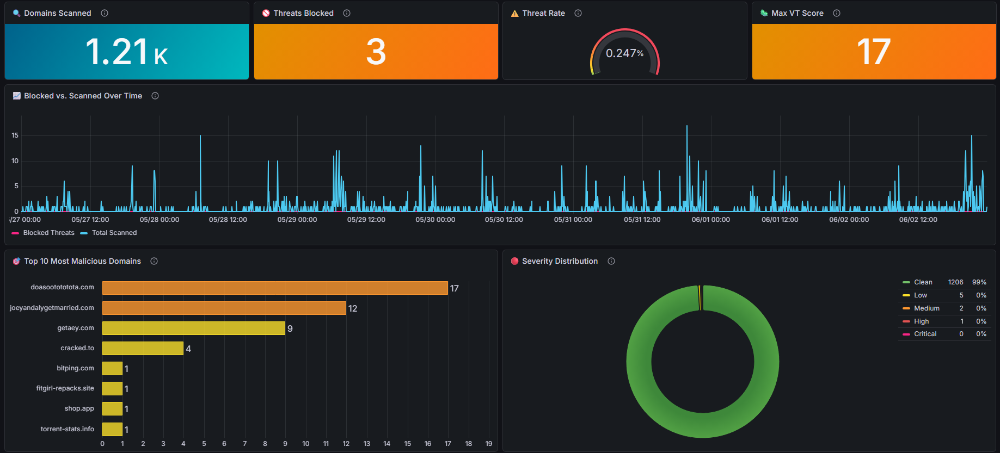
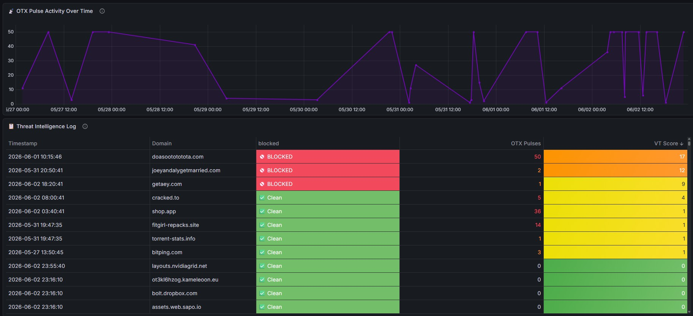

# 🛡️ DNS Threat Intelligence — Automated Pi-hole Security Pipeline

An automated, closed-loop threat intelligence pipeline that monitors your **Pi-hole** DNS traffic, enriches domains through **VirusTotal**, **AlienVault OTX**, **GeoIP** and **RDAP**, applies local heuristics (DGA, typosquat, punycode), autonomously blocks malicious actors, alerts you on **Discord**, and visualizes everything in a real-time **Grafana** dashboard.

> Built with n8n · Pi-hole · InfluxDB · Grafana · VirusTotal · AlienVault OTX · Discord




---

## 📖 How It Works

Every 5 minutes, the pipeline wakes up and runs through a fully automated sequence:

```
VT Quota Check → Pi-hole Logs (primary + secondary) → Merge → Deduplicate + Attribute Client
    → Local Heuristics (entropy / typosquat / punycode) → Cache Check (InfluxDB)
        → Quota Gate → AlienVault OTX Scan
            → GeoIP + ASN → RDAP Domain Age → VirusTotal Scan
                → Block if Malicious (both Pi-holes) → Discord Alert
                    → Store Results (InfluxDB) → Visualize (Grafana)
```

1. **Quota check** — counts today's VirusTotal lookups before doing anything.
2. **Extract** — fetches the last 5 minutes of DNS queries from **both** Pi-holes in parallel.
3. **Deduplicate + attribute** — domains are cleaned and deduplicated, and the most frequent client per domain is retained.
4. **Local heuristics** — entropy/DGA scoring, typosquat detection, and punycode flagging run with **zero API calls**.
5. **Cache check** — already-scanned domains are skipped to preserve API quota.
6. **Quota gate** — if today's VT budget is spent, the domain is parked and retried later.
7. **Enrich** — OTX pulses gate the expensive VT lookup; flagged domains also get GeoIP/ASN and RDAP registration age.
8. **Act** — domains with **≥ 5 malicious detections** are added to both Pi-holes' blocklists.
9. **Alert** — a Discord webhook fires with the domain, client, origin, and which signals tripped.
10. **Log + visualize** — all results are written to InfluxDB and rendered in Grafana.

---

## ✨ What's New in v2

| Feature | Description |
| :--- | :--- |
| **Per-client attribution** | Records *which device* queried each domain, not just the domain |
| **Dual Pi-hole ingest** | Reads query logs from both Pi-holes and merges before dedup |
| **GeoIP + ASN enrichment** | Country and hosting provider for flagged domains |
| **RDAP domain age** | Flags newly-registered domains (< 30 days) |
| **DGA / entropy scoring** | Detects algorithmically-generated domains, no API needed |
| **Typosquat detection** | Levenshtein distance against a watchlist you define |
| **Homograph / punycode** | Flags `xn--` domains used for visual impersonation |
| **Verdict + feed agreement** | Stores `clean`/`suspicious`/`malicious` and VT-vs-OTX agreement |
| **VT quota tracking** | Counts daily lookups; parks overflow instead of failing |
| **Discord block alerts** | Rich notification the moment something is blocked |
| **Weekly digest** | Separate workflow posting a 7-day summary to Discord |
| **6 new dashboard panels** | Quota gauge, feed agreement, top clients, heuristics, timeline, geo map |

---

## 🛠️ Prerequisites

| Service | Notes |
| :--- | :--- |
| **Pi-hole** | v6 API. Two instances supported (primary + secondary) |
| **n8n** | Self-hosted — v1.x recommended |
| **InfluxDB 2.x** | Time-series store |
| **Grafana** | v11+ (dashboard uses the v2 schema; built on v13) |

**API keys required (all free tiers):**
- [VirusTotal](https://www.virustotal.com/gui/my-apikey) — domain reputation (4 req/min, 500/day free)
- [AlienVault OTX](https://otx.alienvault.com/api) — threat pulse intelligence
- **Discord webhook** — Server Settings → Integrations → Webhooks → New Webhook → Copy URL

**Keyless services used automatically:** `ip-api.com` (GeoIP), `rdap.org` (domain age).

---

## 📦 Installation

### 1. n8n Workflows

1. Create a **New Workflow** (import into an *empty* canvas — pasting onto a populated one creates duplicate `…1` nodes with broken references).
2. Import `n8n_workflow.json`. Optionally import `n8n_weekly_digest.json` as a second workflow.
3. **Work through every node in the [Post-Import Node Checklist](#-post-import-node-checklist) below.** Placeholders are not auto-filled, and several nodes need a credential *selected* in the UI — this cannot be done from the JSON.
4. **Activate** the workflow.

> ⚠️ **Importing does not configure anything.** Every `[YOUR_*]` placeholder must be replaced by hand, and each InfluxDB node needs its credential picked from a dropdown. Skipping this produces `401 unauthorized` errors.

---

### 2. InfluxDB Setup

1. In the InfluxDB UI → **Buckets** → create a bucket (e.g. `DNS_Security`).
2. **API Tokens** → generate a token with **Read + Write** access to that bucket.
   - A read-only token makes queries work but every write fails with `401 unauthorized`.
3. Note your **Organization name** — needed in every InfluxDB URL.

**Create the n8n credential once, reuse it everywhere:**

In n8n → **Credentials → New → Header Auth**:

| Field | Value |
| :--- | :--- |
| **Name** | `Authorization` |
| **Value** | `Token YOUR_INFLUXDB_TOKEN` |

> The literal word `Token`, then a space, then your token. Not `Bearer`. Not the bare token. This is the single most common cause of `401 unauthorized`.

---

### 3. Grafana Dashboard

1. **Dashboards → New → Import** and upload `grafana_dashboard.json`.
2. Find-and-replace `[YOUR_BUCKET_NAME]` with your bucket name (appears in ~20 queries).
3. Replace `[YOUR_INFLUXDB_DATASOURCE_UID]` with your InfluxDB datasource UID, or set the datasource per-panel after import.
   - Find the UID in the URL when viewing the datasource: `/connections/datasources/edit/<UID>`.

---

## ✅ Post-Import Node Checklist

Go node by node. **The `authentication` type is pre-set in the JSON, but the credential itself must be selected manually** — n8n cannot ship credentials inside a workflow file.

### InfluxDB nodes — all five need the same treatment

`VT Quota Check` · `Check Influx Cache` · `Log VT Usage` · `Log Deferred` · `Push to InfluxDB`

For **each** of these:
- Replace `[YOUR_INFLUXDB_IP]`, `[YOUR_ORG_NAME]`, `[YOUR_BUCKET_NAME]` in the URL.
- Replace `[YOUR_BUCKET_NAME]` in the Flux **Body** where present.
- Set **Authentication → Generic Credential Type → Header Auth**, then **select your Header Auth credential** from the dropdown.

> Forgetting even one of these five is the most common failure. The read nodes are set to continue-on-error, so they fail **silently** and you only notice empty dashboards.

### Pi-hole nodes

| Node | What to set |
| :--- | :--- |
| `Get Pi-hole Logs` | `[YOUR_PIHOLE_PRIMARY_IP]` |
| `Get Pi-hole Logs 202` | `[YOUR_PIHOLE_SECONDARY_IP]` |
| `Block Main` | `[YOUR_PIHOLE_PRIMARY_IP]` + `[YOUR_PIHOLE_MAIN_TOKEN]` in the `X-Pihole-Authentication` header |
| `Block Backup` | `[YOUR_PIHOLE_SECONDARY_IP]` + `[YOUR_PIHOLE_BACKUP_TOKEN]` |

Running a single Pi-hole? Delete `Get Pi-hole Logs 202`, `Split Out 202`, `Merge Logs` and `Block Backup`, then connect `Split Out` directly to `Filter Unique & Clean`.

### Threat intel API nodes

| Node | What to set |
| :--- | :--- |
| `AlienVault Scan` | `[YOUR_ALIENVAULT_API_KEY]` in the `X-OTX-API-KEY` header |
| `VirusTotal Scan` | `[YOUR_VIRUSTOTAL_API_KEY]` in the `x-apikey` header |

> A `WrongCredentialsError` / `Wrong API key` from VirusTotal means this placeholder is still in place.
> For better hygiene, create a **Header Auth** credential per service instead of pasting keys into header fields.

### Discord

| Node | What to set |
| :--- | :--- |
| `Notify Discord` (main workflow) | `[YOUR_DISCORD_WEBHOOK_URL]` |
| `Notify Discord` (weekly digest) | `[YOUR_DISCORD_WEBHOOK_URL]` |

Paste the full webhook URL (`https://discord.com/api/webhooks/<id>/<token>`). Treat it as a secret — anyone with it can post to your channel.

### Tune it for yourself

Open **`Local Enrich`** and edit the `WATCH` array. It ships with generic brands; typosquat detection is only useful once you add **your** bank, employer, and email provider.

---

## ⚙️ Configuration Variables

| Placeholder | Description | Where to find it |
| :--- | :--- | :--- |
| `[YOUR_PIHOLE_PRIMARY_IP]` | Primary Pi-hole IP | `hostname -I` on the Pi-hole host |
| `[YOUR_PIHOLE_SECONDARY_IP]` | Secondary Pi-hole IP | as above |
| `[YOUR_PIHOLE_MAIN_TOKEN]` | Primary Pi-hole API token | Pi-hole Settings → API |
| `[YOUR_PIHOLE_BACKUP_TOKEN]` | Secondary Pi-hole API token | as above |
| `[YOUR_INFLUXDB_IP]` | InfluxDB host IP | your server/container IP |
| `[YOUR_ORG_NAME]` | InfluxDB organization | InfluxDB UI → Settings |
| `[YOUR_BUCKET_NAME]` | InfluxDB bucket | InfluxDB UI → Buckets |
| `[YOUR_INFLUXDB_DATASOURCE_UID]` | Grafana datasource UID | datasource edit URL |
| `[YOUR_VIRUSTOTAL_API_KEY]` | VirusTotal API key | [VT settings](https://www.virustotal.com/gui/my-apikey) |
| `[YOUR_ALIENVAULT_API_KEY]` | OTX API key | [OTX settings](https://otx.alienvault.com/api) |
| `[YOUR_DISCORD_WEBHOOK_URL]` | Discord webhook | Server Settings → Integrations → Webhooks |

> 🔐 **Never commit real keys.** If a key has ever been pasted into a shared file, chat, or screenshot, rotate it.

---

## 🧠 Detection Logic

### Blocking (deterministic)

A domain is **blocked** when VirusTotal reports **≥ 5 malicious detections**. Adjust in the `If` node.

| VT Detections | Severity | Action |
| :--- | :--- | :--- |
| 0 | ✅ Clean | Logged only |
| 1–4 | 🟡 Low | Logged only |
| 5–15 | 🟠 Medium | Logged + Blocked |
| 16–30 | 🔴 High | Logged + Blocked |
| 30+ | 🔥 Critical | Logged + Blocked |

### Local heuristics (advisory — stored, never auto-block)

Computed in `Local Enrich` for every domain, with no API calls:

- **DGA / entropy** — Shannon entropy over the domain string. Flags `dga_suspect` when entropy > 3.8 **and** length > 12. `google` scores low; `x7fk2m9qp3vz` scores high. Catches algorithmically-generated malware C2 domains.
- **Typosquat** — Levenshtein distance between the registrable label and your `WATCH` list. Distance 1–2 with similar length flags `typosquat` and records the target. An exact match never flags, so `paypal.com` is safe while `paypa1.com` is caught.
- **Homograph / punycode** — flags any label starting `xn--`, the encoding behind lookalikes such as Cyrillic `аpple.com`.
- **Newly registered** — RDAP registration date; flags `newly_registered` under 30 days old.

Any signal marks the verdict `suspicious`. They deliberately **do not** auto-block: each alone is weak evidence, and false positives here would break real browsing. To act on them, add an OR branch before `Block Main`.

### Feed agreement

`both` · `vt_only` · `otx_only` · `neither` — stored as a tag so you can see how often your feeds corroborate each other, and tune the OTX pre-filter.

---

## 🗄️ InfluxDB Schema

**Measurement `domain_threats`**

| Tags | Fields |
| :--- | :--- |
| `domain`, `client`, `country`, `verdict`, `agreement` | `pulses`, `vt_detections`, `blocked`, `entropy`, `domain_age_days`, `dga_suspect`, `typosquat`, `punycode`, `newly_registered`, `asn_org` |

**Measurement `vt_usage`** — `lookup` (one per VT call), `deferred` (one per parked domain).

---

## 📊 Grafana Dashboard Panels

| Panel | Type | Description |
| :--- | :--- | :--- |
| 🔍 Domains Scanned | Stat | Total domains analyzed |
| 🚫 Threats Blocked | Stat | Domains added to the blocklist |
| ⚠️ Threat Rate | Gauge | Percentage flagged as threats |
| 🦠 Max VT Score | Stat | Highest VT detection count |
| 📈 Blocked vs. Scanned | Time series | Blocked overlaid on scan volume |
| 🎯 Top 10 Malicious Domains | Bar chart | Highest-scoring domains |
| 🔴 Severity Distribution | Donut | Clean / Low / Medium / High / Critical |
| 📡 OTX Pulse Activity | Time series | Pulse spikes indicating campaigns |
| 📋 Threat Intelligence Log | Table | Full searchable scan log |
| 🎟️ VT API Quota (Today) | Gauge | Lookups spent vs the 500/day cap |
| 🤝 Feed Agreement | Donut | VT vs OTX corroboration |
| 🖥️ Top Offending Clients | Bar chart | Devices generating the most blocks |
| 🧬 Heuristic Signals | Stat row | DGA / typosquat / punycode / new-domain counts |
| ⏱️ Threat Timeline | Time series | Blocked domains over time |
| 🌍 Geo Threat Map | Geomap | Origin countries of VT-flagged domains |

---

## 🔧 Troubleshooting

**`401 unauthorized` on any InfluxDB node**
- The Header Auth value must be `Token YOUR_TOKEN` — not `Bearer`, not the bare token.
- The credential must be **selected on all five** InfluxDB nodes, not just `Push to InfluxDB`.
- The token needs **write** access to the bucket.

**VirusTotal returns `WrongCredentialsError`**
- `[YOUR_VIRUSTOTAL_API_KEY]` is still a placeholder in the `x-apikey` header.

**Dashboard panels show "No data"**
- Widen the time range — several panels need more than a few minutes of history.
- `Threats Blocked`, `Top Offending Clients`, `Threat Timeline` and `Geo Threat Map` are legitimately empty until something is actually blocked.
- `VT API Quota` stays empty until a domain passes the OTX pre-filter and reaches VirusTotal.

**`Paired item data … is unavailable` / `Can't determine which item to use`**
- Caused by `.item` reach-backs through a node with an error branch. The shipped code uses `.first()` instead. If you see this, a node still contains an old `$('Filter Unique & Clean').item…` expression.

**Duplicate `…1` nodes after import**
- You pasted onto a populated canvas. n8n renames nodes but **not** the node names inside expressions, so references break. Import into an empty workflow.

**All clients show as `pihole` on the secondary Pi-hole**
- Your Pi-holes are chained: the secondary sees the primary as the client. Check the primary's **Settings → DNS → Upstream DNS Servers** — if the other Pi-hole is listed there, they're chained rather than peers. Point both at a real upstream resolver instead, and per-client attribution will resolve correctly.

**VirusTotal daily quota exhausted**
- Free tier is 500/day. The quota gate parks domains at 480 and retries them on later runs — parked domains are intentionally not cached.

---

## ⚠️ Notes & Limitations

- **Auto-blocking has real consequences.** Blocking is driven by a single feed with no human in the loop. Consider an allowlist node before `Block Main` for critical domains (bank, work, OS updates).
- The OTX pre-filter protects the VT budget but **misses brand-new domains** OTX hasn't catalogued — exactly the ones most likely to be fresh phishing. Adding keyless feeds like URLhaus/ThreatFox would narrow that gap.
- Scan error outputs are unconnected: a failed scan is dropped and retried next run rather than logged.
- `client` records the *most frequent* querier per domain, a deliberate simplification for home-scale cardinality.
- GeoIP/RDAP only run on domains that pass the OTX pre-filter.

---

## 🤝 Contributing

Contributions welcome — new threat intelligence sources, alerting integrations, or dashboard improvements. Open an issue or submit a PR.

---

## 📄 License

[MIT](https://choosealicense.com/licenses/mit/) — free to use, modify, and distribute.
